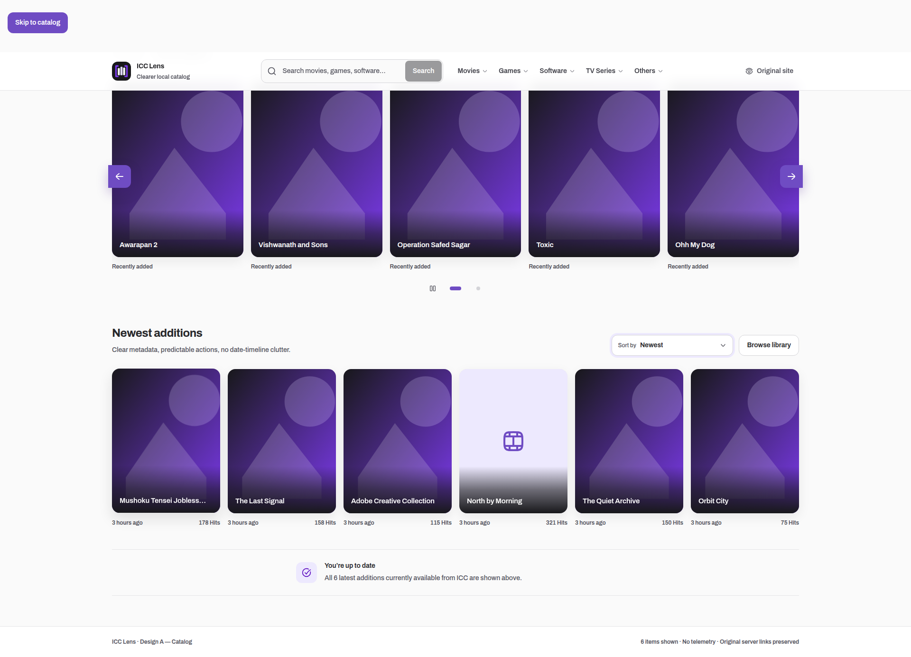

# ICC Lens

> A clearer, faster Chrome interface for the ICC local media server.

[](https://github.com/montasim/ICCLens/actions/workflows/ci.yml)
[](LICENSE)
[](https://www.google.com/chrome/)

ICC Lens replaces the legacy catalog at `http://10.16.100.244/` with a responsive browsing experience for categories, search results, media details, series episodes, archives, and downloads. It is deliberately limited to that private-network origin, sends no analytics or page data elsewhere, and always provides a route back to the original interface.



## Why ICC Lens?

The ICC server exposes useful local media through an interface that is difficult to browse on modern desktop and mobile screens. ICC Lens improves that interface without replacing the server, changing its endpoints, or broadening access beyond the one configured host.

- Browse all 45 observed categories across Movies, Games, Software, TV Series, and Others.
- Search and sort catalog results with responsive, keyboard-accessible controls.
- View movie details and play supported media in an immersive player.
- Open TV series episodes through explicit play and download actions.
- Keep native search, server suggestions, featured content, and pagination available.
- Recover from unsupported or changed markup by returning to the original page.
- Disable or re-enable the enhanced interface from the extension popup.

The observed page contract and approved experience are documented in [prototype coverage](prototype/coverage.md), [PRODUCT.md](PRODUCT.md), and [DESIGN.md](DESIGN.md).

## Install and use

ICC Lens is currently a development-stage extension and is not published in the Chrome Web Store. Install a local build as an unpacked extension.

### Requirements

- Chrome 120 or later
- Access to `http://10.16.100.244/` on the ICC private network
- Node.js 24
- pnpm 11 (the repository pins `pnpm@11.7.0`)

### Build the extension

```sh
git clone https://github.com/montasim/ICCLens.git
cd ICCLens
pnpm install --frozen-lockfile
pnpm build
```

### Load it in Chrome

1. Open `chrome://extensions`.
2. Enable **Developer mode**.
3. Select **Load unpacked**.
4. Choose the generated `.output` directory.
5. Visit `http://10.16.100.244/` while connected to the ICC network.

ICC Lens activates automatically on the supported origin. Use its toolbar popup to turn the enhanced interface off or on for all ICC pages in the current Chrome profile. The **View original page** action remains available when the enhanced page cannot safely represent the server response.

## Local development

Install dependencies and start WXT's Chrome development workflow:

```sh
pnpm install --frozen-lockfile
pnpm dev
```

The extension has no environment variables, external services, accounts, or secrets to configure. Its public identity and release placeholders live in [`product.config.json`](product.config.json); derived icons and theme assets are generated by repository scripts.

## How it works

```text
legacy ICC DOM/fetch ─> ICC DOM adapter ─> normalized page model
                                               │
                                               v
popup ─> local enabled preference ─> shadow-root React interface
```

- `src/domain/` contains pure catalog, page, and preference rules.
- `src/application/` defines use cases and narrow browser-independent ports.
- `src/infrastructure/` adapts ICC markup and Chrome storage.
- `entrypoints/` owns Chrome/WXT lifecycle and presentation wiring.
- `src/features/icc-lens/` contains the user-facing catalog and detail experience.

The background service worker is treated as ephemeral; the enabled preference is durable in Chrome storage. Runtime behavior and failure boundaries are described in [the architecture](docs/ARCHITECTURE.md) and [threat model](docs/THREAT_MODEL.md).

## Privacy and permission boundary

The packaged extension requests only Chrome's `storage` permission and a static content script for `http://10.16.100.244/*`. It does not request cookies, tabs, scripting, downloads, history, broad host access, or `<all_urls>`.

The extension:

- stores only whether the enhanced interface is enabled;
- makes no analytics, telemetry, remote-font, or third-party network requests;
- reads ICC page markup only to present the interface on that same page;
- keeps native server links and download behavior under the server's control.

See the [permission ledger](permission-ledger.md) and [privacy policy](privacy-policy.md) for the complete trigger, data-access, denial, and failure behavior.

## Quality and release

| Command                          | Purpose                                                                        |
| -------------------------------- | ------------------------------------------------------------------------------ |
| `pnpm check:fast`                | Check formatting, toolchain, lint, types, and unit/UI tests                    |
| `pnpm test:e2e`                  | Exercise the unpacked extension in Chromium                                    |
| `pnpm check`                     | Run fast checks, build validation, and the browser journey                     |
| `pnpm check:release`             | Verify release configuration and produce an inspected ZIP and SHA-256 checksum |
| `pnpm verify:prototype:approved` | Confirm the approved HTML/Tailwind prototype gate                              |

GitHub Actions runs the full `pnpm check` workflow on pull requests and pushes to `main`. Version tags matching `v*` run the release-candidate workflow and retain the verified ZIP and checksum as workflow artifacts. Chrome Web Store submission, signing, and publication remain manual.

## Status and limitations

ICC Lens is at version `0.1.0` with a development release status.

- Chrome is the only configured browser target.
- The exact private IP is intentional; ICC Lens does nothing on other origins.
- The project depends on the legacy server's rendered HTML and endpoints. When they change unexpectedly, the extension preserves or restores the original UI instead of guessing.
- The ICC server, linked media, authentication, availability, content rights, and download safety are outside this extension's control.
- A different host, broader access, or new network service requires an explicit permission-ledger, privacy, threat-model, manifest, and test review.
- No public live demo can reproduce the private-network server. The checked-in screenshots and functional prototype provide reviewable UI evidence without exposing private content.

## Documentation

- [Product contract](PRODUCT.md)
- [Design system and states](DESIGN.md)
- [Architecture](docs/ARCHITECTURE.md)
- [Quality levels](docs/QUALITY.md)
- [Prototype workflow](docs/PROTOTYPING.md)
- [Release checklist](docs/RELEASE_CHECKLIST.md)
- [Threat model](docs/THREAT_MODEL.md)
- [Surface contract](docs/SURFACE_CONTRACT.md)

## Support, security, and contributing

Use the [support guide](SUPPORT.md) for usage questions and reproducible defects. Report vulnerabilities privately through the process in [SECURITY.md](SECURITY.md); do not post credentials, browsing data, private media addresses, or unpatched vulnerability details in a public issue.

Contributions are welcome when they preserve the narrow host and permission boundary. Read [CONTRIBUTING.md](CONTRIBUTING.md) for the required workflow and verification commands.

## Author

Built and maintained by [Montasim](https://github.com/montasim).

## License

ICC Lens is open-source software licensed under the [MIT License](LICENSE).
