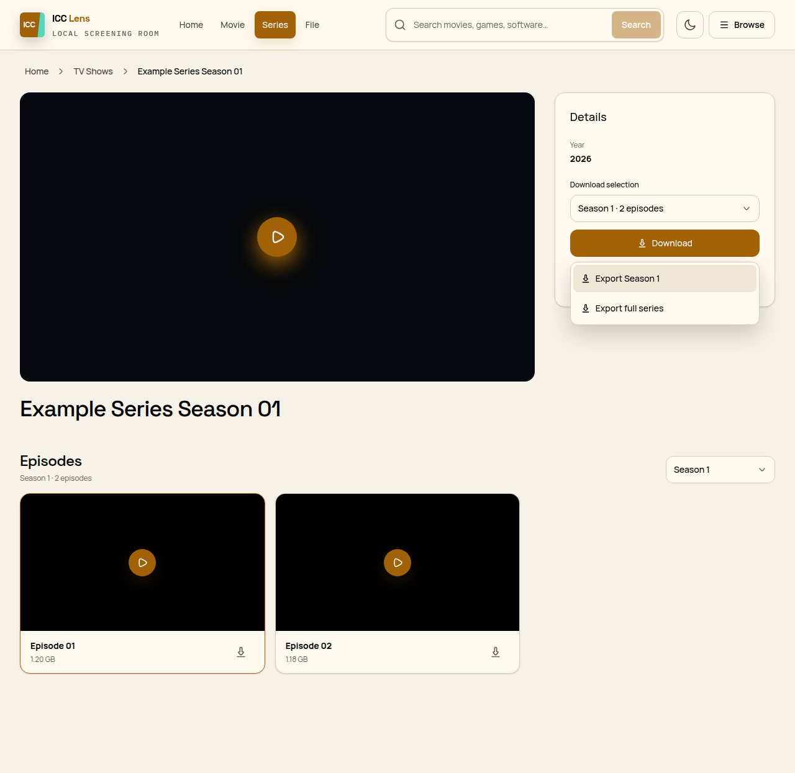

# ICC Lens

> A clearer Chrome interface for the private ICC media server, paired with a public product website.

[](https://github.com/montasim/ICCLens/actions/workflows/ci.yml)
[](https://www.google.com/chrome/)
[](LICENSE)

ICC Lens is for people who already have access to the ICC local media server at `http://10.16.100.244/`. Its Manifest V3 extension reads the page already open in Chrome and replaces the legacy presentation with a responsive catalog, clearer details and downloads, and an immersive player. It does not host media, broaden server access, or send browsing activity to another service.

**[Visit the website](https://icclens.netlify.app) · [View releases](https://github.com/montasim/ICCLens/releases) · [Read the privacy policy](privacy-policy.md)**

> **Release status:** no downloadable GitHub Release is published yet. To use ICC Lens now, build and load the unpacked extension using the steps below.



## What ICC Lens changes

- Replaces home, category, and search results with responsive poster-card grids, consistent sorting, search suggestions, and automatic pagination.
- Keeps category changes in context: Movie pages show movie categories, Series pages show TV categories, and File pages show Games, Software, E-Books, and other non-video groups. Navbar Browse remains global.
- Presents movie and series metadata, season selection, five-column episode cards on wide screens, related titles, individual downloads, and exportable episode-link lists.
- Rebuilds archive and file pages around the original title, artwork, description, ordered files, formats, sizes, and explicit no-download states.
- Provides focused playback with surface-click play/pause, seeking, volume, fullscreen, keyboard shortcuts, buffering and failure states, and episode navigation.
- Stores a bounded local Continue Watching list and lets users clear it from the popup.
- Keeps the original ICC page reachable and restores it when enhancement is disabled or the page cannot be parsed safely.

ICC Lens preserves the server's links and same-origin actions. It does not proxy or copy media, bypass authentication, create accounts, modify server data, launch a download manager, or make the private server available outside its network.

## Use the extension

### Requirements

- Chrome 120 or later
- Existing network access to `http://10.16.100.244/`
- For a local build: Node.js 24 and pnpm 11

### Build and load the current code

```sh
git clone https://github.com/montasim/ICCLens.git
cd ICCLens
pnpm install --frozen-lockfile
pnpm build:extension
```

Then:

1. Open `chrome://extensions` in Chrome.
2. Enable **Developer mode**.
3. Select **Load unpacked** and choose the repository's `.output` directory.
4. Visit `http://10.16.100.244/` while connected to the ICC network.

A successful install adds the ICC Lens toolbar action and replaces supported ICC catalog or detail pages. Use the popup to enable or disable the interface, switch theme, open the server, or clear Continue Watching. The page header's **Original site** action restores the server UI without uninstalling the extension.

### Browse and play

1. Search the library, open a category, or use **Browse** to inspect the complete server catalog.
2. Open a movie or series to review its details and available sources.
3. Choose an episode when needed, then start playback or use a clearly labeled download action.
4. In the player, click the video surface to toggle playback or use the keyboard controls below.

| Key              | Action                              |
| ---------------- | ----------------------------------- |
| `Space` or `K`   | Play or pause                       |
| `Left` / `Right` | Seek backward or forward 10 seconds |
| `Up` / `Down`    | Adjust volume                       |
| `M`              | Mute or unmute                      |
| `F`              | Enter or leave fullscreen           |
| `?`              | Open shortcut help                  |
| `Escape`         | Close help, then exit the player    |

Focused range controls retain their native arrow-key behavior.

## Repository structure

ICC Lens is a pnpm monorepo with two independently built applications:

```text
ICCLens/
├── apps/
│   ├── extension/   WXT, React, and Chrome Manifest V3 extension
│   └── web/         TanStack Start public landing page
├── docs/            architecture, quality, release, and security contracts
├── prototype/       approved functional UI prototypes and coverage
├── scripts/         product generation and artifact verification
├── .output/         generated unpacked extension, ZIP, and checksum
└── netlify.toml     website build and deployment contract
```

The extension follows an inward dependency direction: pure rules live in `apps/extension/src/domain`, use cases and ports in `src/application`, Chrome and legacy-DOM adapters in `src/infrastructure`, and WXT lifecycle wiring in `entrypoints`. The public website shares product identity and design intent but has no runtime bridge to the extension or the private ICC server.

Both apps use React, TypeScript, Tailwind CSS 4, Shadcn-style UI primitives, bundled fonts, and Huge Icons. The extension uses WXT; the website uses TanStack Start and the Netlify TanStack Start integration.

## Develop locally

Install the workspace once:

```sh
pnpm install --frozen-lockfile
```

Start the Chrome extension development workflow:

```sh
pnpm dev
```

Start the landing page at `http://localhost:3000`:

```sh
pnpm dev:web
```

Neither production app requires project environment variables, an account, analytics credentials, or a developer-operated backend. Optional screenshot-capture flags exist only in browser tests.

### Common commands

| Command                | Purpose                                                                 |
| ---------------------- | ----------------------------------------------------------------------- |
| `pnpm dev`             | Run the WXT Chrome development workflow                                 |
| `pnpm dev:web`         | Run the landing page locally                                            |
| `pnpm build`           | Build the extension and website                                         |
| `pnpm build:extension` | Write the unpacked extension to root `.output/`                         |
| `pnpm build:web`       | Build the Netlify-ready website                                         |
| `pnpm test`            | Run extension unit and UI tests                                         |
| `pnpm test:e2e`        | Exercise the unpacked extension in Chromium                             |
| `pnpm check:fast`      | Check formatting, prototype approval, toolchain, lint, types, and tests |
| `pnpm check`           | Add extension artifact, browser-journey, and web-build verification     |
| `pnpm check:release`   | Verify the release ZIP and SHA-256 checksum in addition to all checks   |

## Build, deploy, and release

### Extension artifacts

```sh
pnpm build:extension
pnpm zip
```

The unpacked Chrome extension is written directly to `.output/`. Packaging adds a Chrome ZIP there; `pnpm check:release` also generates and validates its `.sha256` checksum. Local builds do not publish anything.

### Website deployment

The public landing page is live at [icclens.netlify.app](https://icclens.netlify.app). The root [`netlify.toml`](netlify.toml) runs `pnpm build:web`, publishes `apps/web/dist/client`, and supplies the site's security and cache headers. The website uses versionless **Download latest** wording and does not attempt to reach the ICC server.

### GitHub Releases

The [release workflow](.github/workflows/release.yml) runs for `v*` tags. It verifies that the tag matches `apps/extension/package.json`, installs Chromium, runs `pnpm check:release`, and publishes the verified ZIP and checksum to GitHub Releases.

```sh
pnpm check:release
git tag vX.Y.Z
git push origin vX.Y.Z
```

Tagging and pushing are release actions for maintainers. Chrome Web Store submission, signing, and publication are not automated by this repository.

## Privacy, permissions, and safety

The packaged extension has a deliberately narrow access surface:

| Access                                     | Why it is needed                                       | Failure behavior                                           |
| ------------------------------------------ | ------------------------------------------------------ | ---------------------------------------------------------- |
| Chrome `storage`                           | Save enabled state, theme, and bounded watch history   | Falls back to enabled, light theme, and no resume progress |
| Content script on `http://10.16.100.244/*` | Read and enhance the loaded ICC catalog or detail page | Leaves or restores the original page                       |

Watch history contains at most 20 records retained for up to 90 days. Each record is limited to a same-origin page identity, title, optional season and episode, playback position, duration, and update time. External media URLs, posters, searches, credentials, and general page contents are not stored.

The extension requests no wildcard hosts, `tabs`, `activeTab`, `scripting`, cookies, downloads, history, clipboard, unlimited storage, telemetry, remote executable code, or third-party API access. Server HTML and URLs are treated as untrusted input; only HTTP(S) navigation URLs are accepted, and playable media is classified through a known extension allowlist.

See the [permission ledger](permission-ledger.md), [privacy policy](privacy-policy.md), and [threat model](docs/THREAT_MODEL.md) for the complete boundary. ICC Lens does not guarantee the availability, safety, accuracy, or legality of content and downloads supplied by the ICC server.

## Quality and project status

The approved prototypes cover the landing page, popup, catalog, context-aware categories, search, movie and series details, file pages, player, loading, empty, and recovery states. The repository's quality ladder requires the exact packaged behavior—not code presence alone—to pass before release.

GitHub Actions runs `pnpm check` for pull requests and pushes to `main`. A release tag must pass the stricter `pnpm check:release` workflow before a GitHub Release is created. Manual testing against the live ICC server still requires access to that private network.

For the acceptance levels and release handoff, read the [quality ladder](docs/QUALITY.md), [prototype coverage](prototype/coverage.md), and [release checklist](docs/RELEASE_CHECKLIST.md).

## Documentation and participation

- [Product contract](PRODUCT.md)
- [Design system](DESIGN.md)
- [Architecture](docs/ARCHITECTURE.md)
- [Surface contract](docs/SURFACE_CONTRACT.md)
- [Contributing guide](CONTRIBUTING.md)
- [Support guide](SUPPORT.md)
- [Security policy](SECURITY.md)

Use the [issue tracker](https://github.com/montasim/ICCLens/issues) for reproducible defects and usage questions. Do not post credentials, cookies, private media URLs, browsing data, copied server data, or vulnerability details. Security reports should follow the private process in [SECURITY.md](SECURITY.md).

ICC Lens is maintained by [Montasim](https://github.com/montasim) and licensed under the [MIT License](LICENSE).
